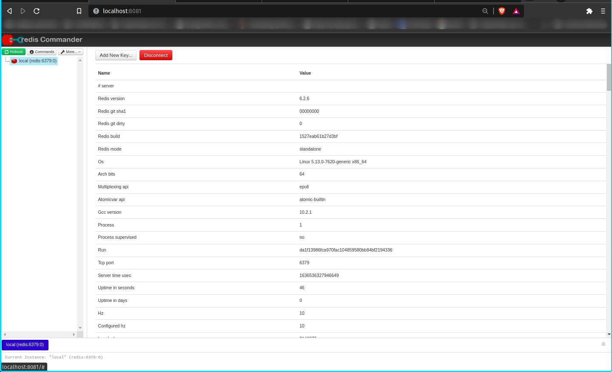

# Rodando Redis-Commander em Docker

### Criando o volume
```
docker volume create redis_vol
```
### Criando a rede
```
docker network create --driver bridge net_redis
```
### Subindo o Container de Banco
```
docker container run --name redis -v redis_vol:/base --network net_redis -d redis
```
### Subindo o Container do PHPAdmin na porta 8181
```
docker container run --rm --name redis-commander -d -p 8081:8081 --network net_redis -e REDIS_HOSTS=local:redis:6379 rediscommander/redis-commander:latest
```
### Dashboard Redis-Commander
